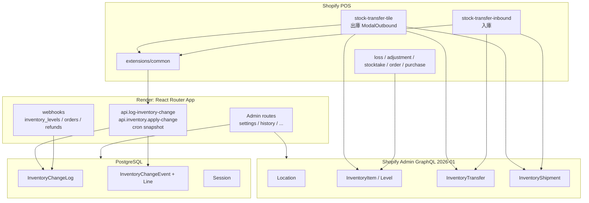

# ARCHITECTURE — POS Stock / 在庫移管

## 1. 全体構成



## 2. データの正（source of truth）

| データ | 正の場所 | 備考 |
|--------|----------|------|
| Transfer / Shipment 状態・数量 | **Shopify** | アプリ DB にコピーしない |
| POS 下書き明細 | `SHOPIFY.storage` | 成功後クリア |
| UI ナビ状態 | localStorage `stock_transfer_pos_state_v1` 等 | |
| 設定 | App metafield `stock_transfer_pos.settings_v1` | |
| 在庫変動履歴行 | Prisma `InventoryChangeLog` | `idempotencyKey` unique |
| apply-change 操作 | Prisma `InventoryChangeEvent` | `appEventId` unique |
| OAuth Session | Prisma `Session` | |

## 3. 出庫アーキテクチャ（核心）

実装の中心は **単一巨大ファイル** `extensions/stock-transfer-tile/src/ModalOutbound.jsx`（1 万行超）。

### 3.1 処理単位の評価

| 単位 | 現状 | 適切性 |
|------|------|--------|
| **Transfer** | Shopify 上の移管ヘッダ。250 明細まで | 正しい正。ただしアプリ側に進捗レコードなし |
| **Shipment** | 発送単位。確定は IN_TRANSIT | Transfer とステータス語彙が異なる点に注意 |
| **250-chunk** | 新規確定で **Transfer×N**（各 1 Shipment） | API 制約への現実解。トランザクション境界なし |
| **Location pair** | origin（POS）+ destination 1 つ | 多ロケバッチジョブではない |
| **UI lock** | `submitLockRef` + `submitting` | 二重タップのみ。クラッシュ/timeout 後の resume には不十分 |
| **job / queue** | **存在しない** | バックグラウンド移管ワーカーはない |
| **InventoryChangeEvent** | Transfer 作成では未使用 | 調整系には適切。移管作成の冪等には未適用 |

**評価（事実ベース）**: 状態の正を Shopify に置くのは妥当。一方、**作成ループの途中状態を永続化していない**ため、timeout / 再実行時の安全性は UI ロックと運用判断に依存する。

### 3.2 主要関数（出庫）

| 関数 | 役割 |
|------|------|
| `submitTransferCore` | 「確定する」本処理 |
| `createTransferAsReadyToShipOnly` | 「配送準備完了にする」 |
| `createTransferReadyToShipWithFallback` | AsReady → 失敗時 Draft→MarkReady |
| `outboundOneTransferWithChunkedShipments` | モード別チャンク振り分け |
| `outboundMultipleTransfersWithInTransitShipments` | 250 超 IN_TRANSIT: Transfer×N |
| `createInventoryShipmentDraftThenMarkInTransit` | Shipment DRAFT→IN_TRANSIT |
| `waitForMissingInventoryLevelsToClear` | レベル反映待ち（既定 20–30s） |
| `ensureInventoryActivatedWithSkuBarcodeRetry` | 追跡有効化 + SKU/barcode 再試行 |

### 3.3 POS GraphQL クライアント

`modalHelpers.js` の `adminGraphql`:

- 既定 **timeout 20s**（AbortController）
- **HTTP 429 自動リトライなし**（サーバーの `withGraphQLRetry` と非対称）

## 4. 入庫アーキテクチャ

- 一覧: `inventoryTransfers`（宛先ロケ）
- 受領: Shipment スコープ。`inventoryShipmentReceiveItems` / `Receive` フォールバック
- 過不足: `adjustInventoryViaApplyChange`（**apply-change + appEventId**）
- 履歴: `buildInboundReceiveLogAppEventId`（delta 内容を含む安定 ID）
- 二重受領対策: **alreadyAccepted との差分** + 失敗後リロード

## 5. apply-change / 履歴（Transfer 以外）

```text
POS → POST /api/inventory/apply-change
  → InventoryChangeEvent (pending → applying → completed|partial_failed|failed)
  → inventorySetQuantities / Adjust（サーバー）
  → InventoryChangeLog upsert

POS → POST /api/log-inventory-change
  → InventoryChangeLog（appEventId ベースの idempotencyKey）
```

出庫確定後の履歴は **log 経路**（Shopify Transfer 成功後）。ログ失敗でも Transfer は残る。

## 6. Webhook・スケジューラ

| 仕組み | 役割 | 移管作成との関係 |
|--------|------|------------------|
| `inventory_levels/update` | 変動ログ・売上/返品突合 | 間接（在庫変動の観測） |
| `orders/updated` / `refunds/create` | 売上・返品履歴 | 移管とは別 |
| Render Cron + snapshot API | 日次スナップショット | **移管ジョブではない** |
| GAS | なし | — |
| GitHub Actions | なし | デプロイは Render + Shopify CLI |

## 7. デプロイ

以下は経路の説明。実行権限・owner・引き継ぎ・承認条件は [DEPLOY.md](./DEPLOY.md) の共通開発運用に従う。公開用Renderはmain/On Commitを確認済みでmain mergeは本番反映となる。Ciara側の実設定は未確認。今回の統合作業ではproduction merge・deploy・publish・rollbackを行わない。

| 対象 | 方法 |
|------|------|
| Admin / API | `main` → Render（自動 or Manual Deploy） |
| POS 拡張 | `npm run deploy:inhouse` / `deploy:public`（`shopify app deploy`） |
| 設定 | `shopify.app.toml`（社内） / `shopify.app.public.toml`（公開） |

詳細: [`DEPLOY.md`](./DEPLOY.md), [`DEPLOY_PUBLIC_AND_INHOUSE.md`](./DEPLOY_PUBLIC_AND_INHOUSE.md), [`CRON_JOB_SETUP_GUIDE.md`](./CRON_JOB_SETUP_GUIDE.md)

## 8. 関連ドキュメント

- [`STATE_MACHINE.md`](./STATE_MACHINE.md) — 状態遷移
- [`SHOPIFY.md`](./SHOPIFY.md) — API 詳細
- [`OUTBOUND_CONFIRM_FLOWS.md`](./OUTBOUND_CONFIRM_FLOWS.md) — 確定ボタン行列
- [`OUTBOUND_TRANSFER_VS_SHIPMENT_STATUS.md`](./OUTBOUND_TRANSFER_VS_SHIPMENT_STATUS.md) — ステータス語彙
