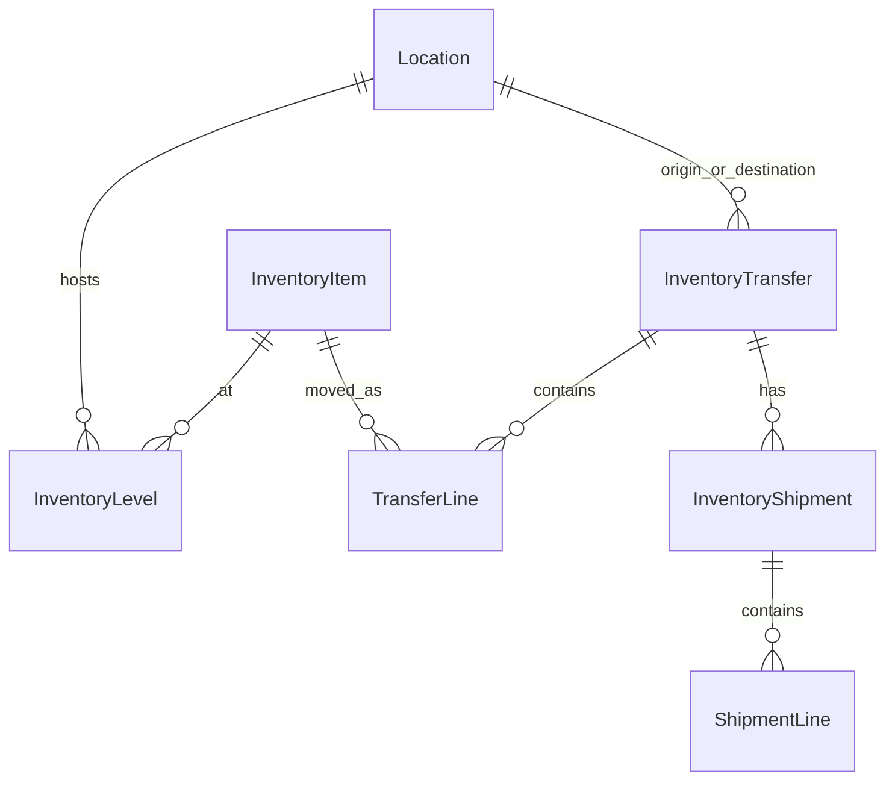

# SHOPIFY — Location / Inventory / Transfer / API

API version・エンティティ関係・エラー分類。設定の正: `shopify.app.toml`（社内）, `shopify.app.public.toml`（公開）。

## 1. API 形態とバージョン

| 項目 | 事実 |
|------|------|
| 主経路 | **Admin GraphQL** |
| バージョン | **2026-01**（webhooks `api_version`, サーバー GraphQL URL） |
| POS | `shopify:admin/api/graphql.json`（埋め込み Direct API） |
| REST | Webhook ペイロード形状・OAuth トークン更新程度。業務 mutation は GraphQL |
| スコープ（抜粋） | `read/write_inventory`, `read/write_inventory_transfers`, `write_inventory_shipments*`, `read_locations`, `read_products`, `read_orders` |

## 2. エンティティ関係

| 概念 | Shopify | アプリでの役割 |
|------|---------|----------------|
| Location | 店舗/倉庫 | 出庫元=POS 現在地、入庫=宛先 |
| InventoryItem | バリアント在庫単位 | 明細キー、activate 対象 |
| InventoryLevel | ロケ×Item の数量 | 出庫前の存在確認・表示 available |
| InventoryTransfer | 移管ヘッダ | 出庫の正。ステータス機械 |
| InventoryShipment | 発送 | IN_TRANSIT / 受領 |
| Adjustment | AdjustmentGroup / set·adjust mutations | ロス・棚卸・入庫補正（Transfer 外） |

### POS との関係

- POS UI Extension が Direct Admin API で上記を操作
- ネイティブ Shopify 管理画面の「在庫移動」と同じ Transfer/Shipment モデル
- POS 販売による在庫減は Webhook `inventory_levels/update` / orders 系で **履歴側**に取り込む（移管作成トリガーではない）

## 3. 主要 Mutations / Queries（移管）

### Transfer

| Operation | 用途 |
|-----------|------|
| `inventoryTransferCreate` | Draft 作成 |
| `inventoryTransferCreateAsReadyToShip` | READY 一発作成（優先） |
| `inventoryTransferMarkAsReadyToShip` | Draft→READY フォールバック |
| `inventoryTransferSetItems` | 明細更新 |
| `inventoryTransferEdit` | note 等（入庫監査メモ） |
| `inventoryTransfers` / `inventoryTransfer` | 一覧・詳細 |

### Shipment

| Operation | 用途 |
|-----------|------|
| `inventoryShipmentCreate` | DRAFT |
| `inventoryShipmentSetTracking` | 追跡情報 |
| `inventoryShipmentMarkInTransit` | 発送確定 |
| `inventoryShipmentReceive` / `ReceiveItems` | 入庫受領（フォールバックあり） |

### Inventory（非 Transfer）

| Operation | 用途 |
|-----------|------|
| `inventoryActivate` | ロケで追跡開始 |
| `inventoryItemUpdate` | 追跡フラグ等 |
| `inventorySetQuantities` | 絶対値セット（棚卸・調整・apply-change）。各 quantity に `changeFromQuantity`（number=CAS / `null`=意図的オプトアウト）。詳細は `DECISIONS` D9 |
| `inventoryAdjustQuantities` | 相対調整（ロス等）。各 change に `changeFromQuantity` を明示（現行は主に `null`） |

**入力配列上限**: lineItems 等 **250**（アプリ定数 `SHOPIFY_ADMIN_LINE_ITEMS_ARRAY_MAX`）。

## 4. Rate limit / Retry

### サーバー（Admin アプリ）

`app/utils/graphql-with-retry.ts`:

- リトライ対象 HTTP: **429, 503**
- 最大追加試行: **3**（計 4 回）
- バックオフ: 1s → 2s → 4s
- **userErrors はリトライしない**（HTTP 成功として返るため）

`inventory-set-quantities-server.ts` にも GraphQL 試行リトライあり。

### POS 拡張

- `adminGraphql` 既定 **20s timeout**
- **429 自動リトライなし**（事実）
- activate は SKU/barcode リフレッシュ付き再試行ヘルパーあり
- 入庫 activate は複数回試行の実装あり

## 5. エラー分類（運用・実装判断用）

| 種別 | 例 | リトライ可？ | 出庫作成での注意 |
|------|-----|-------------|------------------|
| **Rate limit** | HTTP 429, Throttled | サーバー: 可。POS: 自動では不可 | 盲目再実行は二重の恐れ |
| **一時障害** | HTTP 503, ネットワーク切断 | 条件付き可 | timeout 後は Shopify 側確認必須 |
| **Timeout** | POS 20s abort, level wait 30s | ユーザー再実行 | **Shopify のみ成功**があり得る |
| **userErrors（在庫不足等）** | quantity, not stocked | 基本不可（条件修正後） | 同じ入力の連打は無意味 or 危険 |
| **Schema / Field** | CreateAsReady 非対応 | フォールバック実装済み | Draft→MarkReady |
| **部分適用** | setQuantities チャンク途中 | サーバー rollback 試行 | Transfer 作成ループには rollback なし |

## 6. Idempotency と Shopify

Shopify Transfer/Shipment create に対し、本アプリは **クライアント生成の idempotency key を渡していない**（コード上）。\
冪等はアプリ DB（ログ・apply-change）側に閉じている。

## 7. Webhooks（関連）

| Topic | URI | 移管との関係 |
|-------|-----|--------------|
| `inventory_levels/update` | `/webhooks/inventory_levels/update` | 変動観測・売上突合 |
| `orders/updated` | `/webhooks/orders/updated` | 売上 |
| `refunds/create` | `/webhooks/refunds/create` | 返品 |
| `app/uninstalled` 等 | 各 webhook | ライフサイクル |

いずれも **出庫 Transfer を自動作成するスケジューラではない**。

## 8. GAS

**Google Apps Script による Shopify 呼び出しはリポジトリに存在しない。**\
定期処理は Render Cron → snapshot API。

## 9. 参考（既存 docs）

- [`OUTBOUND_TRANSFER_VS_SHIPMENT_STATUS.md`](./OUTBOUND_TRANSFER_VS_SHIPMENT_STATUS.md)
- [`INBOUND_ACTIVATION_FAILURE_CAUSES.md`](./INBOUND_ACTIVATION_FAILURE_CAUSES.md)
- [`API_POS_STOCKTAKE_VS_LOG_INVENTORY.md`](./API_POS_STOCKTAKE_VS_LOG_INVENTORY.md)
- [`CRON_JOB_SETUP_GUIDE.md`](./CRON_JOB_SETUP_GUIDE.md)
