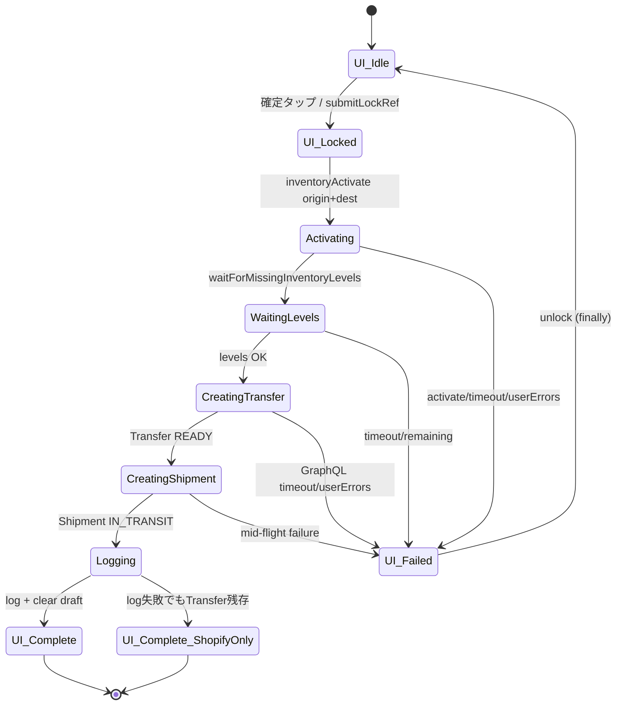
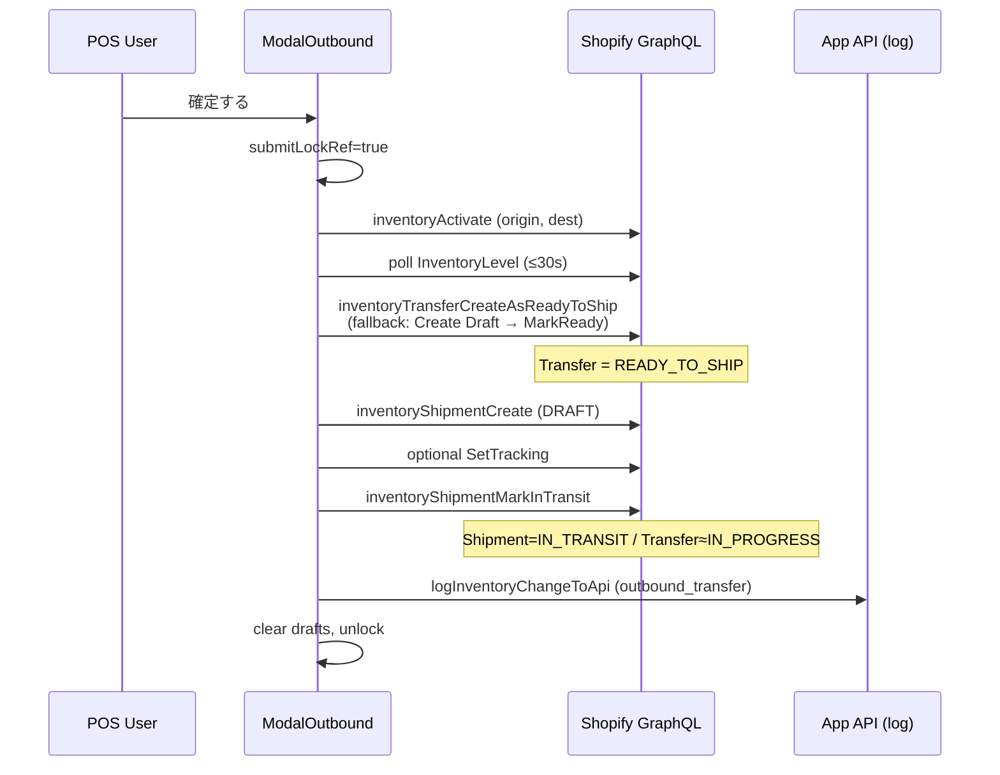
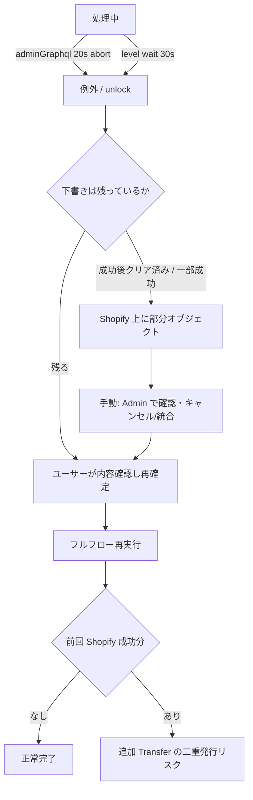
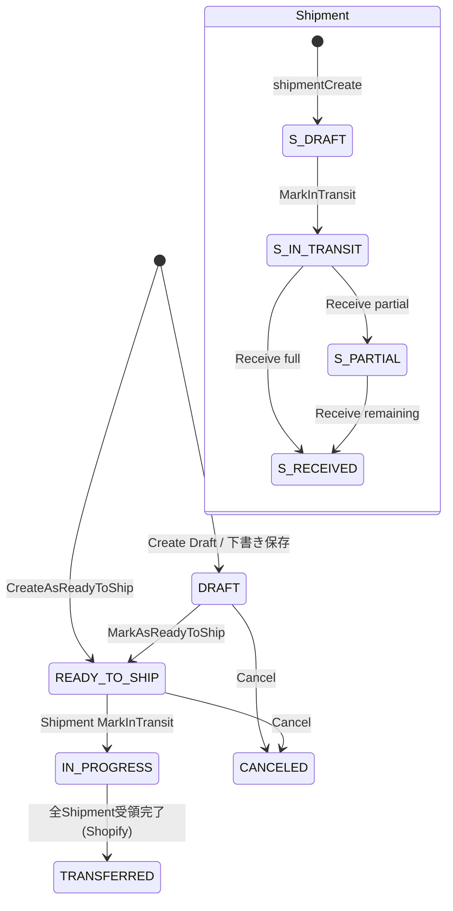

# STATE_MACHINE — 在庫移管の状態遷移と再実行安全性

本ドキュメントは **1 件の出庫確定（在庫移管作成）** と関連する入庫・apply-change の状態遷移を正本として整理する。\
実装: `extensions/stock-transfer-tile/src/ModalOutbound.jsx` ほか。

---

## 1. 状態の単位（現行設計）



| レイヤ | 状態の持ち方 | 永続性 |
|--------|--------------|--------|
| UI | `submitLockRef`, `submitting` | セッションのみ |
| Shopify Transfer | DRAFT / READY_TO_SHIP / IN_PROGRESS / TRANSFERRED / CANCELED | 永続（正） |
| Shopify Shipment | DRAFT / IN_TRANSIT / PARTIALLY_RECEIVED / RECEIVED | 永続（正） |
| Draft 明細 | `SHOPIFY.storage` | 成功後削除。失敗時は残る場合あり |
| 履歴 | `InventoryChangeLog` | 永続・idempotent |
| apply-change | `InventoryChangeEvent` | 永続・idempotent（**Transfer 作成では未使用**） |

**結論**: 「未処理→処理中→完了」のアプリ job は無く、**UI ロック + Shopify オブジェクト状態**が実質の状態機械。

---

## 2. Happy path（新規「確定する」、明細 ≤250）



完了判定（クライアント）:

1. 各 mutation が `userErrors` なし
2. toast 成功
3. 下書きクリア
4. （ベストエフォート）履歴ログ成功

---

## 3. 250 超パス（複数 Transfer）

```text
activate / wait
→ for i in 1..n:
     create Transfer READY (chunk i)
     create Shipment IN_TRANSIT on that Transfer
→ 代表 transfer = 先頭
→ log（sourceId/appEventId は先頭 Transfer 基準）
→ clear / unlock
```

**チェックポイントなし。** i=2 で失敗しても i=1 の Transfer/Shipment は Shopify に残る。

---

## 4. Timeout → retry → resume → 完了（実態）

アプリに「resume トークン付きワーカー」は **ない**。実態は次のとおり。



| 事象 | コード上の挙動 | Resume の意味 |
|------|----------------|---------------|
| 二重タップ | lock 中は toast「処理中です…」で no-op | — |
| activate / level timeout | throw → alert → unlock | 最初から再実行 |
| GraphQL 20s timeout | throw。サーバー側で mutation 成功済みの可能性 | **危険域** |
| 複数 Transfer 途中失敗 | 先行分は残存 | **自動 resume なし** |
| ログのみ失敗 | Transfer 残存、UI はクリア方向 | ログ再送は appEventId で比較的安全 |

---

## 5. Shopify Transfer / Shipment 状態（正）



入庫側の完了: Shipment 受領進捗 → Transfer `TRANSFERRED`。UI は fully received で readOnly。

---

## 6. apply-change 状態機械（調整系・入庫補正）

Transfer 作成とは **別系統**。

```text
pending → applying → completed
                   ↘ partial_failed / failed
```

- 同一 `appEventId` が `completed` → 即 OK 返却（冪等）
- `pending` / `applying` → 202（処理中）
- サーバー GraphQL は 429/503 を `withGraphQLRetry`（最大 3 回、指数バックオフ）

---

## 7. 再実行安全性マトリクス（最重要）

| シナリオ | リスク | 現行の防御 | 残ギャップ |
|----------|--------|------------|------------|
| 二重タップ | 二重 Transfer | `submitLockRef` | ロックはメモリのみ |
| API 成功後・状態保存（ログ）失敗 | 履歴欠落。在庫は Transfer 済み | log の idempotency | Transfer ロールバックなし |
| timeout 直前に Shopify のみ成功 | ユーザー再実行で二重 | なし | **高** |
| retry 重複（出庫作成） | 二重 Transfer | なし（作成 API に idempotency key なし） | **高** |
| 完了済ロケーションの再実行 | 出庫は「ロケ完了フラグ」モデルではない | — | 該当 job なし。再確定は新規作成扱い |
| 部分成功（250 分割） | 先頭チャンクのみ成功 | なし | **高** |
| 途中停止（アプリクラッシュ） | 上に同じ | 下書きが残れば再入力容易 | Shopify 側の掃除は手動 |
| 同時実行（2 端末） | 二重 | 端末ローカル lock のみ | **高** |
| trigger 重複 | Cron は snapshot のみ | 移管トリガーはユーザー操作 | Cron による移管二重はなし |
| 入庫受領の再実行 | 二重受領・二重調整 | delta vs alreadyAccepted + 安定 appEventId + note マーカー | 比較的低い |
| apply-change 再送 | 二重 set | `appEventId` unique | 設計意図どおり |

### Idempotency の境界

```text
[防御あり]
  InventoryChangeLog.idempotencyKey
  InventoryChangeEvent.appEventId
  Webhook 系 idempotencyKey
  入庫 receive の差分計算

[防御なし / 弱い]
  inventoryTransferCreate*
  inventoryShipmentCreate* / MarkInTransit
  出庫 UI ロック（永続・分散なし）
```

---

## 8. 処理対象の抽出・完了判定

| フェーズ | 抽出 | 完了 |
|----------|------|------|
| 出庫新規 | UI `lines` → `lineItems` | mutation 成功 + UI クリア |
| 出庫 250 分割 | `chunkLineItemsWithMeta` | 全チャンクループ成功（途中失敗時は未定義完了） |
| 入庫一覧 | destination の `inventoryTransfers` | Transfer/Shipment ステータス |
| 入庫受領 | shipment lineItems − alreadyAccepted | receive mutation + 必要なら finalize |
| 日次 snapshot | Bulk Operation | bulk completed（移管とは無関係） |

---

## 9. Error handling の層

| 層 | 扱い |
|----|------|
| GraphQL `userErrors` | `assertNoUserErrors` で throw |
| POS network/timeout | Promise.race / Abort → catch → toast/alert |
| Server 429/503 | `withGraphQLRetry`（POS クライアントには無い） |
| apply-change 部分適用 | `partial_failed` + rollback 試行（set quantities サーバー） |
| finally | **必ず** `submitLockRef=false` |

userErrors（ビジネス）はリトライしても同じ結果になりやすい。network / 429 はリトライ候補だが、**出庫作成を盲リトライすると二重発行**になる。

---

## 10. 「ロケーション単位処理」について

調査結果:

- 出庫は **origin 1 + destination 1** のペア処理。activate/wait はロケ単位
- **複数ロケーションをキュー処理する移管ジョブはコード上存在しない**
- 「完了済ロケーションをスキップして再開」型の状態フラグも **出庫作成には無い**
- 類似パターンは棚卸のグループ完了・apply-change の lineStatus 側に存在する

過去に「ロケーション単位・timeout・途中再実行」の修正が入っている可能性が高い領域は **棚卸 / snapshot / Webhook**。移管作成にそのジョブモデルを投影しないこと。

---

## 11. 棚卸確定の状態分離（COMPLETE_RETRY 正本）

実装: `InventoryCountList.jsx` + `api.pos-stocktake-complete` + `api.inventory.apply-change`。  
詳細 UI: [`STOCKTAKE_COMPLETE_RETRY_DESIGN.md`](./STOCKTAKE_COMPLETE_RETRY_DESIGN.md)、画面方針: [`STOCKTAKE_UX_CANON.md`](./STOCKTAKE_UX_CANON.md)。

### 現行確定順（正本）

差異あり:

```text
確定タップ
→ submitLockRef
→ apply-change（履歴先行 upsert → setQuantities → 履歴 quantityAfter 確定）  // 冪等: appEventId
→ pos-stocktake-complete（metafield read/merge/write、サーバー自動リトライ）
→ 成功: toast / clear draft / unlock
→ metafield 失敗かつ setQuantities 済み: needMetafieldRetry（編集不可・メタのみ再試行）
```

差異なし: metafield 更新のみ（setQuantities なし）。

| 状態 | 意味 | 再試行でやってよいこと |
|------|------|------------------------|
| `quantitiesApplied` | apply-change 成功 | **再 setQuantities 禁止**（同一 appEventId） |
| `needMetafieldRetry` | メタ未反映 | `retryOnly` または同一ペイロードで metafield のみ |
| `completed` | メタ反映済み | なし |

二重 setQuantities 防止: `quantitiesAppliedRef` + `InventoryChangeEvent.appEventId` 冪等。
